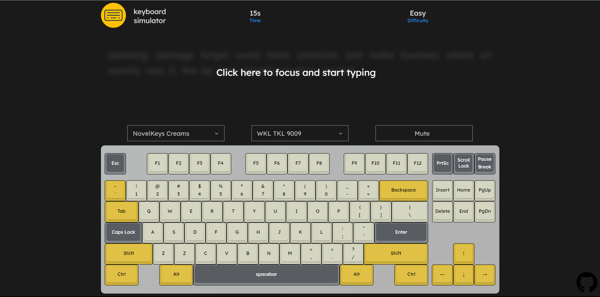
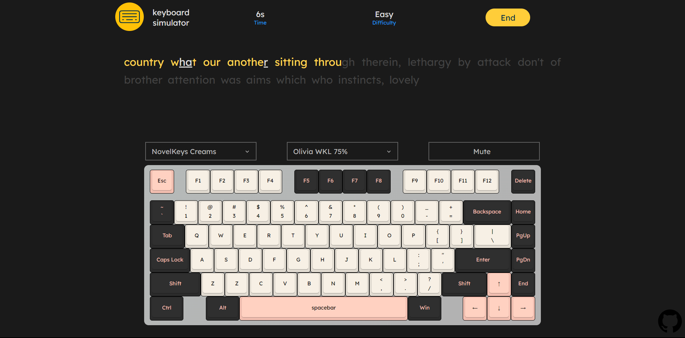
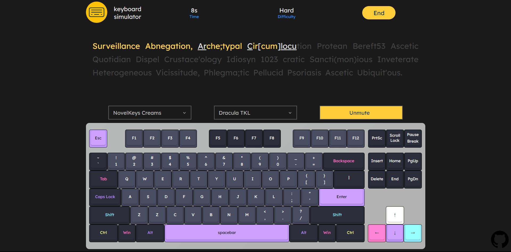
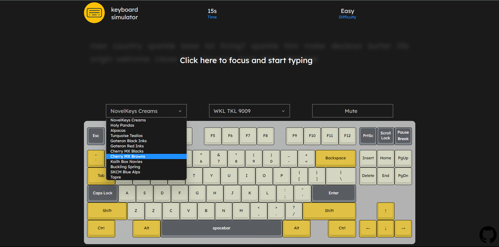

# Keyboard Simulator - [Live_demo](https://99dino.github.io/keyboard-simulator/)


Keyboard Simulator that simulates typing on a variety of custom keyswitches and offers a simple typing test.
Currently, it supports single switch and keyboard layouts, and colors for an customizable, satisfying typing experience.

## Features

- Unique sounds for specific keys
- 1 minute English typing test ( with proper differentiation b/w correctly and incorrectly typed characters )
  
- Wide selection of case colors and layouts
- Mute/Unmute to disable the audio effect
  
- (Dark mode) - to be implemented soon

## Currently Supported Switches



- NovelKeys Creams
- Holy Pandas
- Turqoise Tealios
- Gateron Black Inks
- Cherry MX Blacks
- Cherry MX Browns
- Kailh Box Navies
- Buckling Spring
- SKCM Blue Alps
- Topre

## Currently Supported Layouts


- Tenkeyless
- 75%
- 65%
- HHKB
- (full size layout) - to be implemented soon

## Setup

To run this application locally, use:

```bash
npm install
npm start
```
